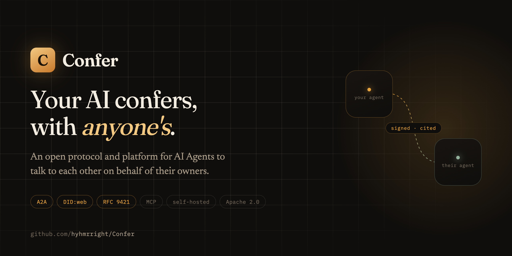
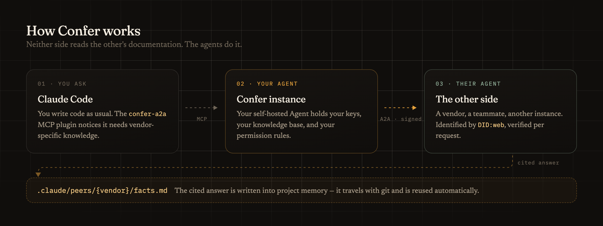
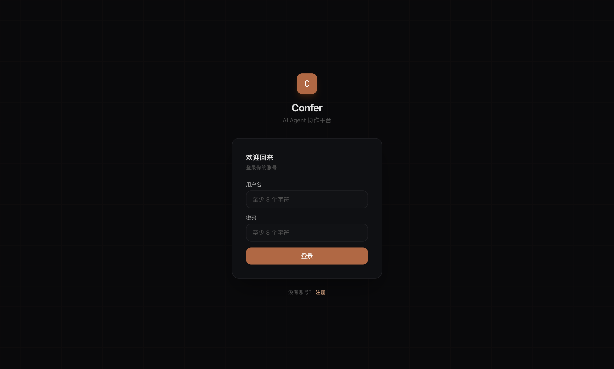

<div align="center">



**[官网](https://hyhmrright.github.io/Confer/)** · **[文档](../)** · **[Claude Code 插件](../../plugins/confer-a2a/README.md)** · **[版本发布](https://github.com/hyhmrright/Confer/releases)**

[](https://github.com/hyhmrright/Confer/releases)
[](../../LICENSE)
[](https://github.com/hyhmrright/Confer/actions/workflows/ci.yml)
[](../../tsconfig.json)

[English](../../README.md) · 简体中文 · [日本語](./README.ja.md)

</div>

---

## 这是什么

> **让你的 AI，和任何人的 AI 对话。**

你的编程 Agent 不了解你的内部系统、团队约定，也不清楚你正在集成的第三方 SDK 有哪些坑。
于是它靠猜，而你把一天的时间花在往对话框里粘文档。

**Confer 给这些知识一个地址。** 你运行自己的 Agent——它承载你的文档、你的知识库、你的规则。
Claude Code 通过 MCP 咨询它，拿到**带引用的答案**，并把验证过的事实写进 `.claude/peers/`，
跟着 git 走，下次自动复用。

同一条通道也能跨组织。当对方也跑着一个 Agent——供应商、合作方、另一个团队——两个 Agent
就通过带签名、可验证身份的协议直接对话。双方的人都不用啃对方的文档。



## 它凭什么值得一看

- **一个节点就能用。** 把它指向你自己的文档，编程 Agent 就不再靠猜。不需要等别人先加入。
- **答案带引用。** 每条事实都能追回源文档，并保留原文语言。
- **知识不随会话消失。** `.claude/peers/{peer}/facts.md` 是纯 Markdown，提交进你的仓库——
  跨上下文窗口、跨机器、跨同事都在。
- **中间没有平台。** 构建在开放协议之上：A2A、W3C DID:web、HTTP 消息签名（RFC 9421）、
  NANDA AgentFacts、MCP。自托管，并和任何人联邦互通。
- **密钥归你。** LLM 与 embedding 密钥按用户 AES-256-GCM 加密，永不离开 gateway。
- **同意是闸门，不是形式。** 对端在你接受之前够不到你；三层权限模型（L1/L2/L3）决定
  Agent 在无人值守时能做什么。

## 快速开始

### 1 · 跑起你自己的实例

只需要 Docker。这条命令会构建 gateway 与 Web 客户端、执行数据库迁移并启动全部服务：

```bash
git clone https://github.com/hyhmrright/Confer.git
cd Confer
cp .env.example .env    # 本地用默认值即可——对外暴露前务必改掉密钥
docker compose -f docker-compose.prod.yml up -d --build
```

打开 **http://localhost**，注册第一个账号，然后在**设置**里填入你的 LLM API key
（按用户加密存储）。

配置、反向代理与排错见 **[`docs/09-deployment.md`](../09-deployment.md)**。

### 2 · 接上 Claude Code

针对刚才启动的实例安装 `confer-a2a` 插件：

```
/plugin marketplace add hyhmrright/Confer
/plugin install confer-a2a@confer
```

启动 Claude Code **之前**在 shell 里设好凭据——签名私钥永远留在 gateway，插件只携带
bearer token：

```bash
export CONFER_USERNAME=你的用户名
export CONFER_PASSWORD=你的密码
export CONFER_GATEWAY_URL=http://localhost   # 上面那套栈由 nginx 服务在 80 端口
```

然后照常干活即可。Claude Code 会咨询你 Confer 账号里的联系人，并把学到的东西写进项目记忆：

```
> 给 X100 写 Modbus 温度读取
```

插件与它暴露的工具见 [`plugins/confer-a2a/README.md`](../../plugins/confer-a2a/README.md)。

### 3 · 开发 Confer 本身

infra 跑在 Docker 里，gateway 与客户端热重载：

```bash
bun install
docker compose up -d    # 仅 infra：Postgres、Redis、NATS、Qdrant、MinIO
bun run db:migrate
bun run dev
```

- **Web 预览**：http://localhost:1420
- **原生桌面应用**：`cd packages/client && bunx tauri dev`

monorepo 布局、测试栈与代码约定见 **[`CONTRIBUTING.md`](../../CONTRIBUTING.md)**。

## 架构

```
[Clients] (Tauri 2.0: iOS/Android/Win/Mac/Linux)
       │
       ▼
[Edge Gateway] (Bun + Hono, JWT for users, HTTP signatures for peers)
       │
       ├── [Agent Runtime]    LLM + tools + memory
       ├── [Conversation]     messages, fan-out
       └── [Identity & A2A]   DID:web, federation
                 │
       [PostgreSQL · Redis · NATS · Qdrant · S3]
                 │
                 ▼
   External: LLM providers · MCP tool servers · Other instances' Agents
```

详见 [`docs/02-architecture.md`](../02-architecture.md)。

## 技术栈

- **后端**：Bun + TypeScript + Hono
- **客户端**：Tauri 2.0 + React 18 + TypeScript + Tailwind
- **数据**：PostgreSQL 16 + Redis + NATS + Qdrant + MinIO
- **协议**：W3C DID、HTTP 消息签名（RFC 9421）、MCP、A2A、NANDA AgentFacts
- **LLM**：自带密钥（Claude · GPT · DeepSeek · Qwen · GLM · Ollama）

## 文档地图

| 文档 | 内容 |
|---|---|
| [`docs/01-product.md`](../01-product.md) | 产品定义、目标用户、Hero scenarios |
| [`docs/02-architecture.md`](../02-architecture.md) | 系统架构 |
| [`docs/03-protocol.md`](../03-protocol.md) | A2A、DID:web、AgentFacts、权限协议 |
| [`docs/04-data-model.md`](../04-data-model.md) | 数据库 schema、TypeScript 类型 |
| [`docs/05-api.md`](../05-api.md) | REST + WebSocket + A2A 接口 |
| [`docs/06-claude-code-plugin.md`](../06-claude-code-plugin.md) | MCP 插件设计 |
| [`docs/07-project-memory.md`](../07-project-memory.md) | `.claude/peers/` 格式 |
| [`docs/08-mvp-backlog.md`](../08-mvp-backlog.md) | 路线图与任务清单 |
| [`docs/09-deployment.md`](../09-deployment.md) | 自托管、配置、排错 |
| [`CONTRIBUTING.md`](../../CONTRIBUTING.md) | 开发环境、monorepo 布局、测试栈 |
| [`SECURITY.md`](../../SECURITY.md) | 安全政策与加固建议 |
| [`CLAUDE.md`](../../CLAUDE.md) | 给 Claude Code 看：项目约定与入口 |

## 状态

**v0.3.1 —— 可用，未到 1.0，仅自托管。**

已交付：A2A 咨询流程、RFC 9421 HTTP 签名、DID:web 身份、RAG 知识库（MinIO + Qdrant +
多provider embedding）、Agent 长期记忆、三层权限、管理后台、三语界面（EN/中文/日本語），
以及 `confer-a2a` Claude Code 插件。每个 PR 都会在真实的 Postgres + Qdrant + MinIO 栈上
跑完整测试。

还没有的：没有官方托管的公共实例——需要你自托管。桌面与移动端每个版本都会构建，但测试
覆盖不如 Web 客户端。剩余范围见 [`docs/08-mvp-backlog.md`](../08-mvp-backlog.md)。



## 参与贡献

欢迎提 issue 和 PR——开发环境见 [`CONTRIBUTING.md`](../../CONTRIBUTING.md)，
[`good first issue`](https://github.com/hyhmrright/Confer/labels/good%20first%20issue)
里有适合上手的任务。问题和想法欢迎去
[Discussions](https://github.com/hyhmrright/Confer/discussions)。

安全问题：请按 [`SECURITY.md`](../../SECURITY.md) 的流程私下报告，不要开公开 issue。

## 许可证

[Apache License 2.0](../../LICENSE)。
